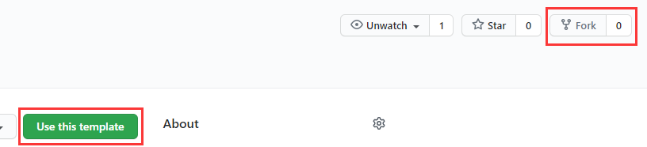
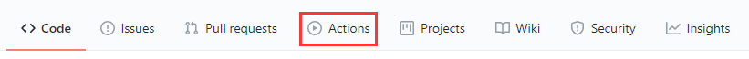
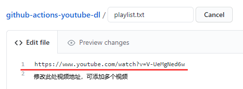
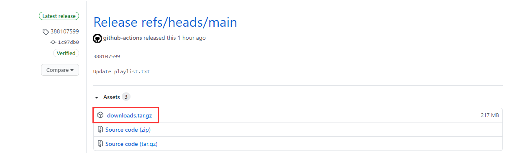

# Github-actions-youtube-dl 

使用 GitHub Actions 下载 YouTube 最高画质视频，并自动发布到 Release。

## 注意！

- **Github Release 最高可以发布 2G 大小的文件，注意自己的压缩包大小不要超过 2G。**（[官方文档说明](https://docs.github.com/cn/free-pro-team@latest/github/managing-large-files/distributing-large-binaries)）

- **请大家下载完成后尽量删除 Release 中无用的视频文件**

- **✨善待 GitHub**

## 使用

1. Fork 本仓库 或者 Use this template。

2. 创建好自己的仓库后，在 Actions 中启用 GitHub Actions（Use this template 默认启用）。

3. *按需更改 config.txt 中的内容（非必要步骤，可以在此调整 youtube-dl 的下载参数）*。
4. 将你要下载的 YouTube 视频的地址填进 **playlist.txt** 中，每行限一个视频链接，commit push 提交。

5. Actions 自动运行后会将所有下载好的视频打包成 downloads.tar.gz 发布到 **Release** 中。
6. 进入 Release，下载打包好的压缩文件。

## License

[MIT](https://github.com/Heraldik/github-actions-youtube-dl/blob/main/LICENSE) © Heraldik

## 鸣谢

[justjavac](https://github.com/justjavac/github-actions-youtube-dl)

